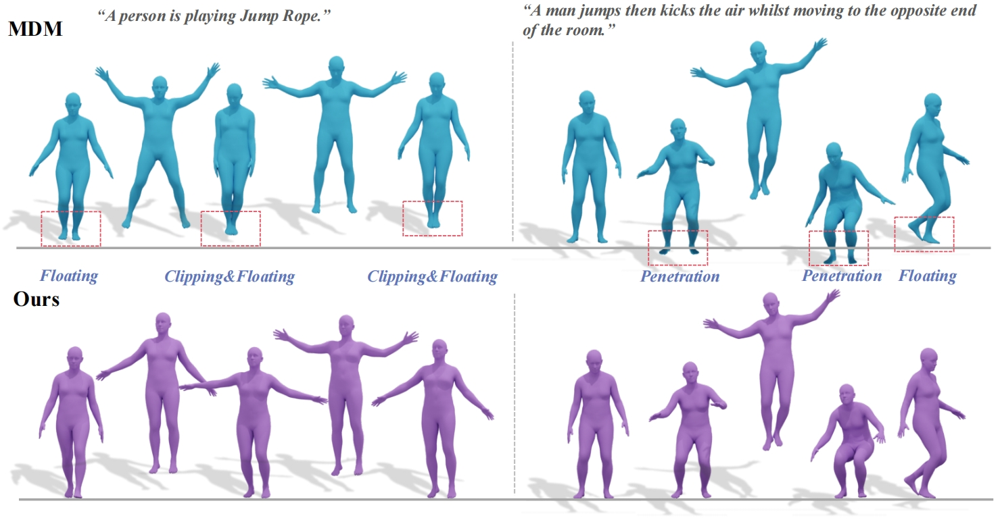

# ReinDiffuse: Crafting Physically Plausible Motions with Reinforced Diffusion Model

#### 
[[Project Page](https://reindiffuse.github.io)] | [[Paper]()]  

<!-- 
#####  
 [xxx](xxx),

-->

  

#### 
Our ReinDiffuse can generate physically plausible motion, effectively eliminating common physical issues such as floating, penetration, foot clipping, and skating. ReinDiffuse enables MDM to learn physical commonsense with reinforcement learning. 

Coming soon!... 🏗️ 🚧 🔨

